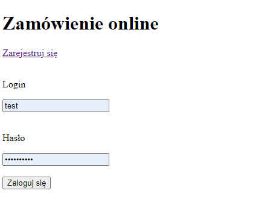

# PHP exemplary project
> Project to test PHP code

## Table of contents
* [General info](#general-info)
* [Screenshots](#screenshots)
* [Technologies](#technologies)
* [Setup](#setup)
* [Features](#features)
* [Status](#status)
* [Inspiration](#inspiration)
* [Contact](#contact)

## General info
The project was designed to check how the PHP version of registration and login works.
Project wos inspired by self education with help of `https://miroslawzelent.pl/kurs-php/`

## Screenshots

## Technologies
* PHP 8
* XAMPP 8

## Setup
No steps required

## Features
List of features
* Login and logOut functionality

To-do list:
* CSS styling

## Status
Project is: _in progress_

## Inspiration
Project inspired by `https://miroslawzelent.pl/kurs-php/`

## Contact
Created by [@AdamSobieraj](https://github.com/AdamSobieraj) - feel free to contact me!